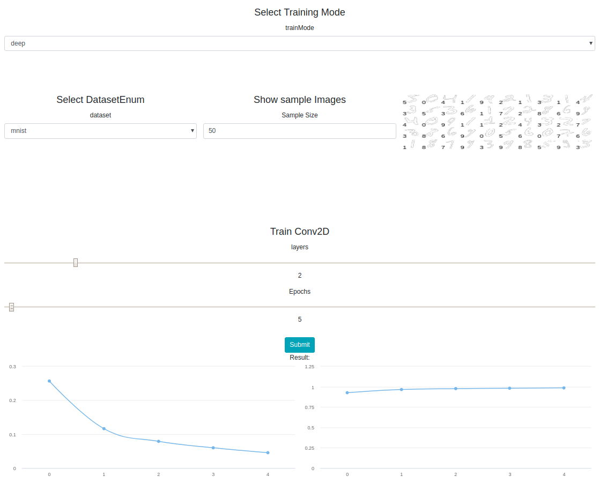

# Train deep learning image networks

Use either a deep net or a conv net to train on different datasets.  
Layers and epochs can be defined.

# Run in development mode

Run in project root: `docker-compose up`  
Access on `localhost:3000`.

# Demo

